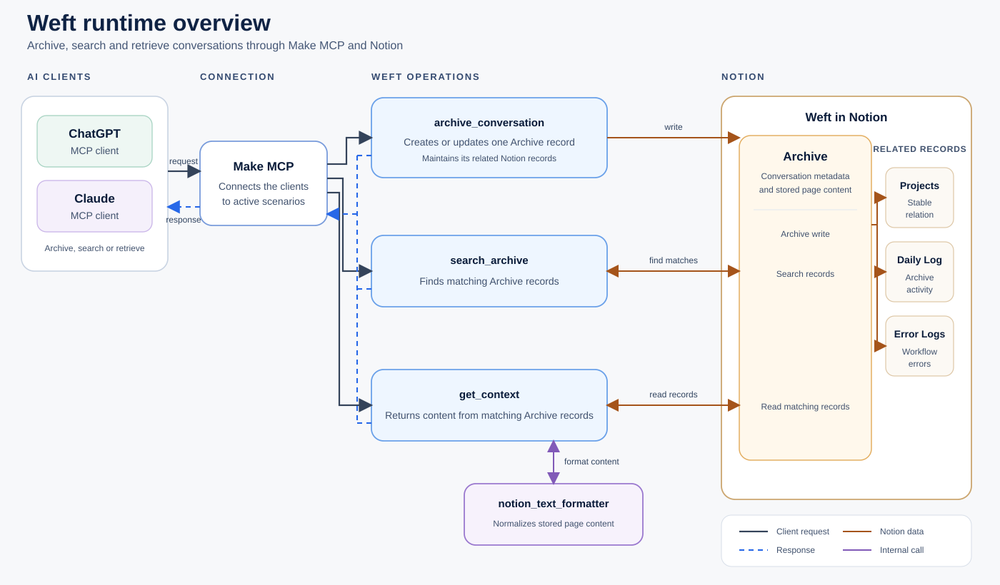

# Weft

I built Weft because my project ideas and decisions were spread across different AI conversations. When I returned to a project later, a new chat could not retrieve what had happened elsewhere. I had to reconstruct the background before I could continue.

I wanted to choose which conversations were worth keeping, store them as complete records and retrieve the original content when I needed it again.

Weft archives, searches and retrieves that context through Make, Notion and MCP. It worked in my own environment, but making it installable in another account exposed dependencies that the original workflows did not have to handle.

## What it does

Weft provides three operations:

| Operation | Result |
|---|---|
| `archive_conversation` | Creates or updates a stored conversation. |
| `search_archive` | Returns matching archive records. |
| `get_context` | Returns stored conversation content from matching Archive records. |

Make runs the workflows. Notion stores the records in a form that remains readable and inspectable. MCP-enabled clients call the operations.

The diagram shows how the main parts connect. ChatGPT or Claude sends an archive, search or retrieval request through Make MCP. Make runs the corresponding workflow, while Notion stores the Archive and its related records. `notion_text_formatter` is used internally when `get_context` retrieves stored page content.

The workflows can also be inspected directly in Make. These shared scenarios show the modules, routes and mappings, but they are not connected to a visitor’s own Make and Notion resources. Make therefore marks the unresolved account-specific connections and references. Use the installer when you want to create configured copies in your own environment.

- [`archive_conversation`](https://eu1.make.com/public/shared-scenario/UrKrdWWmdo8/weft-archive-conversation)
- [`search_archive`](https://eu1.make.com/public/shared-scenario/kMLUtxQJb2L/weft-search-archive)
- [`get_context`](https://eu1.make.com/public/shared-scenario/vH1RABSc2t1/weft-get-context)
- [`notion_text_formatter`](https://eu1.make.com/public/shared-scenario/CxwoCdhvFcx/weft-notion-text-formatter)
- [`create_daily_log`](https://eu1.make.com/public/shared-scenario/HXO6dZj0Leo/weft-create-daily-log)

## What became difficult

### Rebuilding the workflows in another account

A Make export still contains resources that belong to the account where it was created: connections, Data Structures, Notion database properties and references to other scenarios. Importing a blueprint does not make those dependencies portable.

I built a Python installer that discovers the target resources, replaces only approved bindings and checks the generated scenarios before creating them. It then reads the scenarios back through the Make API and leaves them inactive for review.

The blueprints in `setup/Make/blueprints/` remain unchanged. The installer creates separate copies, applies the target account’s connections and resource references to those copies, checks them and then creates the scenarios in Make.

The installer does not blindly repeat a create request when the result is uncertain. It first checks what exists and either continues from verified state or stops when it cannot establish ownership safely.

The installation path is documented in [SETUP.md](./SETUP.md). The implementation is in [`installer/`](./installer/).

### Protecting an existing archive record

Each stored conversation has a stable `conversation_id` and belongs to one normalized project key.

If a later request tries to attach that conversation to a different project, Weft returns `PROJECT_CONFLICT` without changing the Archive record or creating related records. If the Project record has disappeared but the stored key still matches, Weft recreates the missing Project and repairs the existing relation instead of creating another Archive.

These paths are defined in the [payload contract](./contracts/payload-contract.md) and tested in the [V4 regression report](./regression-tests/Weft_full_regression_test_report_archive_conversation_V4.md).

### Finding errors behind a successful Make run

Some of the hardest failures did not make the scenario fail. Make completed successfully while the response was still wrong.

One search found several records but returned only one because separate Make bundles had not been aggregated into the final response array. Other defects turned existing Notion values into null through incorrect typed mappings, or included page labels such as Conversation ID and Message count in full_content instead of returning only the archived conversation.

I traced those failures across the contract, Make run output and stored Notion values, then added checks for the response shape and the assumptions introduced by each fix. The write and retrieval paths, including their remaining evidence boundaries, are documented under [`systems/`](./systems/).

## Inspect or reproduce Weft

- Start with [SETUP.md](./SETUP.md) to reproduce the complete system.
- Use the [payload contract](./contracts/payload-contract.md) for the three operations.
- Inspect the [Archive Conversation](./systems/archive-conversation/README.md) and [Context Retrieval](./systems/context-retrieval/README.md) documents for implementation details and failure history.

On 19 August 2026, I installed Weft from a newly downloaded copy of the repository on Windows using new Notion, Make, ChatGPT and Claude accounts, and tested archiving, searching and retrieval through both AI clients.

## Current boundaries

Weft is a reference implementation, not a hosted service or a general-purpose AI memory platform.

- Notion template duplication, connection authorization, MCP exposure and final client acceptance remain manual steps.
- Weft does not support semantic search.
- Repeating an accepted archive request with the same conversation_id reuses the existing Notion record instead of creating another one. The existing page content is not overwritten: the content from the new request is appended below it. Weft does not currently detect whether those appended blocks duplicate content that is already present.
- The reproduced Make MCP 403 workaround is documented, but the underlying gateway rule is unknown.

The complete list is maintained in [`setup/known-limitations.md`](./setup/known-limitations.md).

## License

Weft is licensed under the [Apache License 2.0](./LICENSE).
