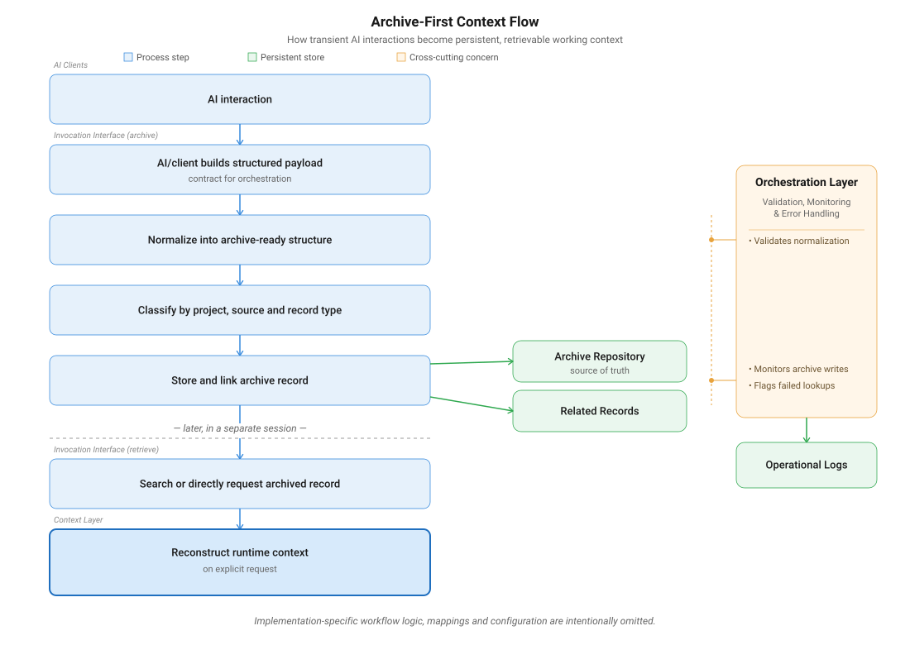

# Archive-First Context Flow

This document describes the public architecture behind archiving AI-assisted work in Weft and retrieving it later as runtime context.

It explains the workflow boundary, not a deployable Make blueprint.

Implementation-specific orchestration logic, Make module configuration, private mappings, filters, runtime payloads and database relation details are intentionally omitted.

Public schemas and contract examples are documented elsewhere in the repository to show the workflow boundaries without exposing live workflow data.

---

## Two Phases, Not One Pipeline

This flow has two separate phases that happen at different times.

It is not one continuous pipeline.

### 1. Archive

During or after an AI-assisted work session, a client or workflow invocation sends a structured payload.

The orchestration layer validates, normalizes, links and stores that payload as an archive record.

Where available, the record can be linked to related structures such as:

* project records
* daily log records

The archive record becomes the persistent source record for the archived interaction.

### 2. Retrieve

Later, in a separate session and only through an explicit request, the system can retrieve archived content.

Retrieval can happen through:

* direct identifier lookup
* search followed by selection
* context reconstruction from a stored archive record

The retrieved content is rebuilt from the archived record.

Retrieval does not reinterpret meaning, generate missing source content or modify the stored archive record.

---

## Layer Responsibilities

This flow follows the same layer model described in:

* [`layer-model.md`](./layer-model.md)
* [`system-overview.md`](./system-overview.md)

| Layer                | Responsibility in this flow                                                         |
| -------------------- | ----------------------------------------------------------------------------------- |
| AI / Client Layer    | Provides the interaction or workflow output that may be archived                    |
| Invocation Interface | Defines the request boundary into the orchestration system                          |
| Orchestration Layer  | Handles validation, routing, linking, writes, retries and failure handling          |
| Context Layer        | Shapes archive payloads and reconstructs stored records into usable runtime context |
| Data Layer           | Stores archive records, relations and operational evidence                          |

The AI client does not own persistence.

The archive is the source of record for explicitly archived workflow state.

---

## Validation, Monitoring and Error Handling

Validation, monitoring and error handling are cross-cutting concerns.

They are not one single sequential step.

In this flow, they support:

* validating incoming payloads against the expected boundary
* checking whether required identifiers and relations can be resolved
* preventing unresolved or ambiguous writes
* monitoring whether archive writes succeed or fail
* logging persistent execution failures for later review

Some transient execution failures may be retried by the orchestration layer or platform configuration.

Persistent failures are surfaced through controlled failure handling and operational logging.

---

## Design Rationale

The archive flow exists because AI chat history is not a reliable source of project memory.

Weft stores selected AI-assisted work as structured, searchable and project-linked archive records.

Runtime context is reconstructed from archived evidence only when requested.

This keeps a clear distinction between:

* what is stored
* what is retrieved
* what is currently in use

The result is a system where project context can move across sessions, AI clients and workflow tools without depending on one temporary chat.
