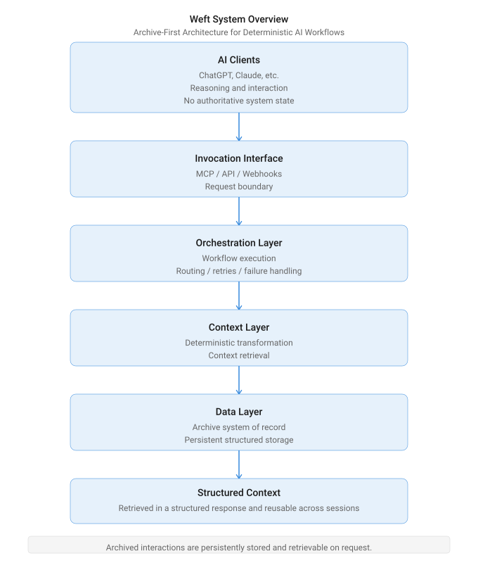

# System Overview

## What this page is

This page gives a short orientation to how Weft fits together before going into the detailed architecture documents.

It does not repeat the full architecture.

For the full layer model, see [`layer-model.md`](./layer-model.md).

---

## In One Line

AI interactions and workflow outputs are archived as structured records and retrieved later only through explicit workflow calls.

```text
interaction → archive_conversation → archive record → retrieval on request
```

The AI client is not the memory layer.

The archive is the source of record.

See: [`../case-studies/archive-conversation-system/`](../case-studies/archive-conversation-system/)

---

## Architecture Diagram



---

## Invocation Model

Workflows are triggered through explicit invocation routes.

Current routes include:

* MCP-enabled invocation from ChatGPT
* MCP-enabled invocation from Claude
* webhook/API-style structured requests

The architecture is interface-agnostic: different clients can trigger the same workflow when they provide the expected payload shape.

Details: [`layer-model.md`](./layer-model.md)

---

## System Flows

Weft separates write, discovery and retrieval behavior.

| Flow                 | Purpose                                                  |
| -------------------- | -------------------------------------------------------- |
| Archive Conversation | Write an interaction or workflow output into the archive |
| Search Archive       | Find existing archive records through explicit filters   |
| Get Context          | Retrieve archived content for continued work             |

Full flow description: [`archive-conversation-flow.md`](./archive-conversation-flow.md)

---

## Where to Go Next

* [`layer-model.md`](./layer-model.md) — system layers and responsibilities
* [`archive-conversation-flow.md`](./archive-conversation-flow.md) — archive and retrieval workflow behavior
* [`../case-studies/archive-conversation-system/`](../case-studies/archive-conversation-system/) — write-side case study
* [`../contracts/payload-contract.md`](../contracts/payload-contract.md) — public workflow boundaries
* [`../schemas/`](../schemas/) — public boundary validation
* [`../examples/public-contracts/`](../examples/public-contracts/) — public-safe example payloads
* [`../proof/`](../proof/) — runtime evidence and debugging records
