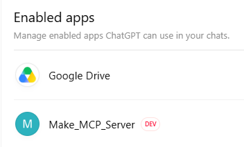
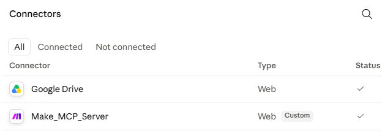
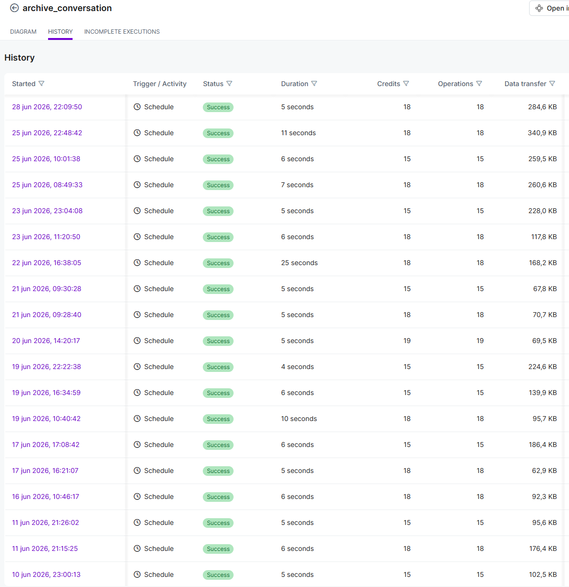
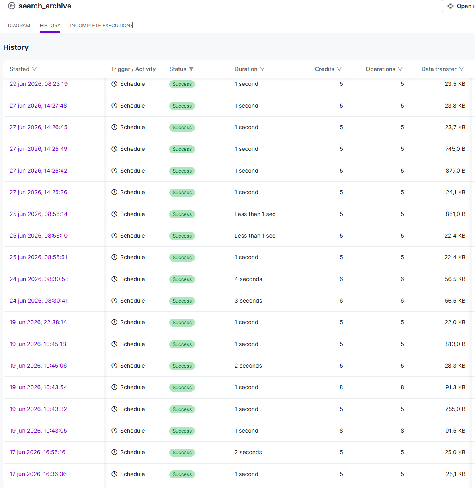
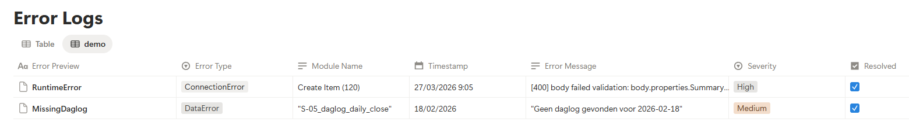

# Screenshots

This folder contains public-safe screenshots used as runtime evidence for Weft.

The screenshots show that key workflows run in practice. They do not expose private Make scenario logic, module mappings, webhook URLs, Notion database IDs, internal relations or raw archive content.

---

## Included screenshots

### MCP Server Connected

Shows the private `Make_MCP_Server` connection enabled inside ChatGPT. This provides public-safe evidence that Weft can be invoked through an MCP-enabled boundary from ChatGPT, without exposing server configuration, credentials, URLs, Make scenario details, Notion database IDs or private archive content.

Shows the same private `Make_MCP_Server` connection available as a custom web connector in Claude. This supports the architectural claim that Weft is designed around an AI-client-agnostic invocation boundary, rather than being tied to one chat interface.

These screenshots prove the MCP connection boundary. Runtime workflow execution is documented separately through the Make and Notion evidence screenshots below.

### Make — Archive Conversation

Shows repeated successful executions of the `archive_conversation` scenario. This provides operational evidence that archive writes run in practice, while detailed scenario logic, mappings, module configuration and runtime payload instances remain intentionally unpublished.

### Make — Search Archive

Shows runtime evidence that the `search_archive` workflow executes successfully. Detailed query construction, Notion filter configuration and internal mapping logic are intentionally unpublished.

### Make — Get Context

Shows runtime evidence that archived context can be retrieved through the `get_context` workflow. Internal block reconstruction, mapping details and private archive content are intentionally unpublished.

### Notion — Archive Database

Shows structured archive records with stable conversation identifiers, project linkage, source metadata, extraction type, model origin and archive status. Raw content, payload JSON, detailed relations and private workflow data are intentionally hidden.

### Notion — Error Logs

Shows that workflow errors are logged for observability and debugging. Private error payloads, internal identifiers and detailed scenario mappings are intentionally hidden.

---

## Boundary

These screenshots support the claim that Weft is a working system in the author’s own workflow.

They do not claim that Weft is a finished product, a SaaS platform or a generally deployable system.
