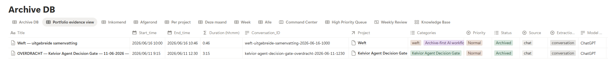

# Archive Conversation System

`archive_conversation` is Weft's public write contract. It validates a structured conversation, normalizes timestamps and metadata, resolves Daily Log and Projects relations, checks stable `conversation_id` identity, and then creates or updates one Archive record.

## Implemented flow

```text
public input
→ deterministic normalization
→ required-field validation
→ transcript and storage-payload assembly
→ Daily Log lookup/create
→ Project lookup
→ if Project is missing, search Archive before Project creation
→ apply the stored-project-key conflict guard
→ create, reuse, or repair Project only when permitted
→ create or update the selected Archive record
→ append full page content
→ structured response
```

The scenario uses `Europe/Amsterdam` for local-time normalization. Module 62 is the deterministic canonical boundary; validation uses its trimmed conversation ID before any Notion operation. A whitespace-only ID therefore returns `validation_error` without a lookup or write.

A conversation ID is bound to one canonical project key. If the same ID is requested with a different key, the workflow returns `PROJECT_CONFLICT` with the existing Archive identity and makes no Project, Archive, page-content, or Error Log change. If the requested Project is absent but an existing Archive has the same key and no valid Project relation, the repair route recreates the Project once and updates that existing Archive relation.

The public request and response are defined in [`../../contracts/payload-contract.md`](../../contracts/payload-contract.md), [`../../schemas/archive-conversation/`](../../schemas/archive-conversation/) and [`../../examples/public-contracts/archive-conversation/`](../../examples/public-contracts/archive-conversation/). A focused engineering note documents how the current datetime boundary emerged from parsing, validation, explicit `end_time`, and timezone defects: [`engineering-notes/datetime-normalization-and-timezone.md`](./engineering-notes/datetime-normalization-and-timezone.md).

> **Known Make MCP interoperability issue:** archive requests containing
> Markdown-formatted `python -m ...` commands can be rejected with HTTP 403
> before this scenario executes.
>
> See
> [`troubleshooting/make-mcp-403-markdown-python-module-command.md`](./troubleshooting/make-mcp-403-markdown-python-module-command.md)
> for the verified diagnosis and workaround.

## Evidence boundary

The screenshot below shows Make run-history evidence for this scenario. The Notion screenshot shows persisted records from the same workflow. The current Route 1–7 record is the [V4 regression report](../../regression-tests/Weft_full_regression_test_report_archive_conversation_V4.md). It records the expected MCP/Make response and confirms every manual assertion defined by the test procedure for all seven route classes on 6 August 2026, including the prepared preconditions for Tests 6 and 7. The confirmation is limited to the listed assertions and does not prove every theoretically possible side effect, fresh provisioning, or live execution of a later canonical blueprint revision.




The canonical blueprint is [`../../setup/Make/blueprints/weft_archive_conversation.json`](../../setup/Make/blueprints/weft_archive_conversation.json). The end-to-end installation flow is documented in [`../../SETUP.md`](../../SETUP.md); supporting provisioning and rebinding references are under [`../../setup/`](../../setup/).

## Scope

This system does not search or retrieve context. Those responsibilities belong to [`../context-retrieval/`](../context-retrieval/). Automated merge, semantic deduplication, version history and multi-user conflict resolution are outside the published implementation.
