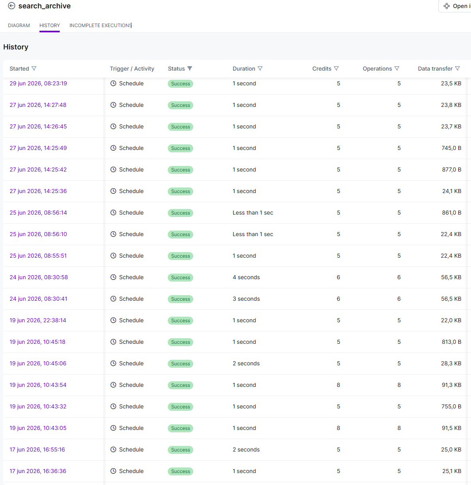
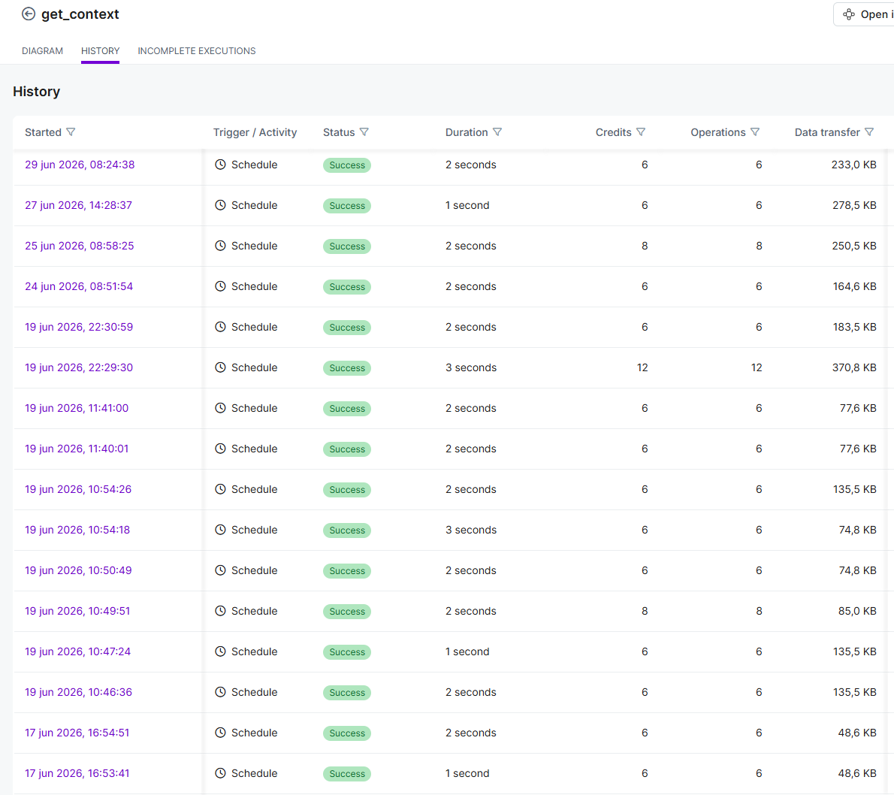

# Context Retrieval System

The read side of Weft consists of two public MCP scenarios.

- `search_archive` returns compact archive candidates through conversation-ID, exact-date, date-range, project and query routes.
- `get_context` returns full persisted content through conversation-ID, query, exact-date and project routes.

`get_context` calls the internal `weft_notion_text_formatter` scenario after listing Notion page content. The exported `slice(...; 2; 3)` expression selects the established subset of page-content bundles passed to the formatter before full-content assembly. It remains an implementation detail because the resulting selection and assembly behavior has been accepted in client testing; it is not part of the public request or response contract.

## Contract behavior

Both scenarios return structured arrays, route-specific messages, explicit counts, empty-result envelopes and `success: false` validation responses. Search results use `key_insights` and `model_origin`; full-context results add title, project, full content, message count, content length and conversation ID.

`search_archive` supports both exact-date and date-range retrieval. Its date-range upper bound is calculated with `Europe/Amsterdam`. `get_context` supports conversation-ID, query, exact-date, and project retrieval; its date-based route is intentionally exact-date only, so `date_from` and `date_to` must both be supplied and equal.

See [`../../contracts/payload-contract.md`](../../contracts/payload-contract.md), [`../../schemas/search-archive/`](../../schemas/search-archive/), [`../../schemas/get-context/`](../../schemas/get-context/) and [`../../examples/public-contracts/`](../../examples/public-contracts/).

## Evidence boundary

These restored images are representative Make run-history screenshots. They support that the workflows ran, but do not by themselves prove every client regression route, API read-back, or a fresh installation.

Implementation investigations are stored locally with this system:

- [`proof/case-01-response-contract-aggregation.md`](./proof/case-01-response-contract-aggregation.md)
- [`proof/case-02-date-range-filtering-in-notion-search.md`](./proof/case-02-date-range-filtering-in-notion-search.md)
- [`proof/case-03-single-result-leak-after-search.md`](./proof/case-03-single-result-leak-after-search.md)
- [`proof/case-04-notion-relation-array-iterator-mapping-with-value-id.md`](./proof/case-04-notion-relation-array-iterator-mapping-with-value-id.md)

The broader debugging and contract-stabilization path is summarized in [`engineering-notes/contract-and-retrieval-debugging.md`](./engineering-notes/contract-and-retrieval-debugging.md), including the aggregator, typed Notion mapping, content-selection, and long-content regression work.

Canonical blueprints are [`../../setup/Make/blueprints/weft_search_archive.json`](../../setup/Make/blueprints/weft_search_archive.json), [`../../setup/Make/blueprints/weft_get_context.json`](../../setup/Make/blueprints/weft_get_context.json) and [`../../setup/Make/blueprints/weft_notion_text_formatter.json`](../../setup/Make/blueprints/weft_notion_text_formatter.json).

## Scope

The published workflows do not provide semantic ranking, automatic context composition, AI-generated search ranking or autonomous record selection. They retrieve the explicit persisted source content.
